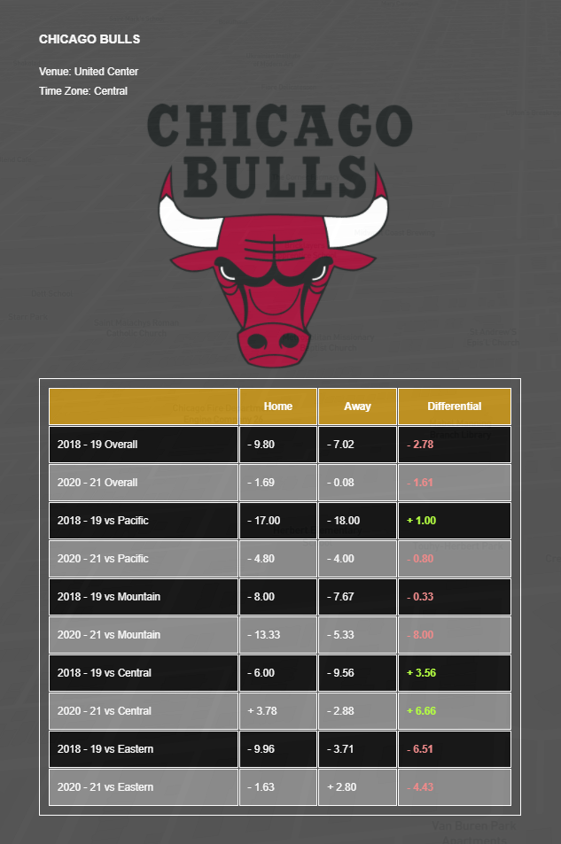
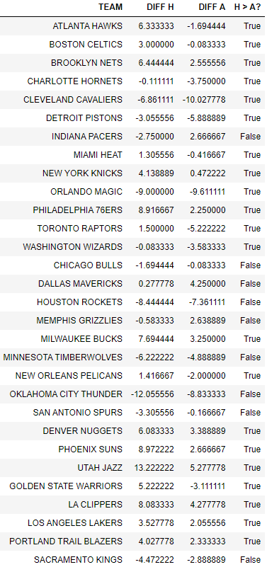
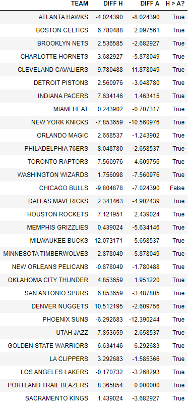

# Pandemic Basketball 2020-21

## I. Introduction

In the history of professional sports, there has always been questions surrounding [home advantage](https://en.wikipedia.org/wiki/Home_advantage): 
Does it even exist? If so, what causes it? 
The three most commonly believed and cited factors are: 

1. <b>Crowd involvement: The psychological effects of cheering and booing from fans.</b> 
<i>Example: In Americans football, fans tend to stay silent when the home team is on offense, making it easier to run audibles and hear snap counts.
Conversely, crowds generate as much noise as possible when the opposing team has the ball to try to disrupt communication.</i>

2. <b>Travel considerations: The physical effects of travel fatigue and/or time-zone differential.</b> 
<i>Example: A traveling team is limited to hotel accomodations while the home team has all the luxuries of players' own homes.</i>

3. <b>Environmental factors: The familiarity of the environment (eg. weather, altitude).</b> 
<i>Example: In baseball, every stadium has different dimensions, giving the home team a slight advantage via the familiarity of their own park.</i>

Since all basketball stadiums are indoors with standard dimensions, environmental factors are naturally limited in the NBA. Outside of a few standalone factors, such as the high altitude in Denver, players can expect more or less the same environment every single game. Furthermore, due to the COVID-19 pandemic, the 2020-21 NBA Season saw the majority of teams either heavily limit or outright prohibit fan attendance. Thus, with two major factors essentially out of the equation, this project will use data and statistics from the season to see the effects of travel on home court advantage. This will then be compared with 2018-19 numbers to extrapolate the effects of crowd involvement.

## II. Methodology

### A. Data

#### Raw

Both seasons' results are downloaded directly from [Fixture Download](https://fixturedownload.com/sport/basketball). 
Fixure Download data are first ran through Google Sheets for the "Split text to columns" feature. This splits the original "Result" column into two columns
("Home Score" and "Away Score") for better manipulation. All data are then processed in Jupyter Notebooks using primarily the pandas and geopandas libraries.

The main statistics in focus are points scored by the home team and points scored by the away team. The main calculation revolves around differential. Due to the nature of the NBA,
every season sees different teams in the top and bottom of the standings. Therefore, raw points numbers and win/loss records are not good indicators when comparing across different seasons.
A better team will be expected to score more points and win more games than a rebuilding one, regardless of home or away. Differentials compares a team's home performances to their
away performances. In other words, a good team may win both at home and on the road, but only winning by a bigger margin at home will count towards a home court advantage.
Likewise, even if a rebuilding team loses at home and away, if the games are closer at home, then there are still signs of an advantage.

#### Mapbox Studio

The layers included in the Mapbox interface are all mostly done by hand. After 29 building polygons (one for each NBA arena) are duplicated from the base layer,
each layer is filtered to only include the polygons of the venue it is representing. As the user scrolls, the layers turn on and off via opacity.

The two exceptions are:

1. The Time Zones layer.

The data is taken from [USDOT](https://data-usdot.opendata.arcgis.com/datasets/usdot::time-zones/about). The shapefile is directly loaded to Mapbox Studio.

2. The Venues layer.

The data is obtained from [HIFLD](https://hifld-geoplatform.opendata.arcgis.com/datasets/geoplatform::major-sport-venues/about). The data is processed in a Jupyter Notebook with its
CRS changed in QGIS to convert its original meters unit to degrees. The final geojson is then uploaded to Mapbox Studio.

### B. Medium for Delivery / User Interaction

This map is a web browser-based application accessible across desktop devices. It will operate on a baseline of HTML/CSS/JS using the Mapbox storytelling feature.
Mapbox's introduction to interactive storytelling can be found [here](https://www.mapbox.com/solutions/interactive-storytelling).

Due to the nature of storytelling, the user cannot interact with the map directly. The story chapters are predetermined and laid out for the user to simply scroll through.
It starts off with the overall background of the project and continues on a journey through NBA teams one by one. It is geared for sports enthusiasts who will understand
the numbers and highlights presented.

### C. Application Layout

Figure 1. The very first wireframe draft using United Center in Chicago as an example.

Figure 2. The finalized look of Chicago's information box.

### D. Aesthetics

The color scheme reflects a simple grayscale design. The team's home building's polygon is highlighted in green when the user scrolls to the it. This is to set it apart from
the buildings around it to better accentuate its features.

All logos are courtesy of [Logos World](https://logos-world.net/).

### E. Conclusion

The data does not seem to support time zones being a significant factor in teams' performances. There are no noticeable patterns in differentials when teams travel around the country.

However, a more general look at overall home/away differentials show strong signs of home court advantage. A boolean is run to test whether home numbers are better than away.
A "True" means the team's performance at home are generally stronger than on the road.

21 of 30 NBA teams still performed better at home in the 2020-21 season when traveling considerations are the only major factor. This leads to me believe that although the time difference
may not be influential, traveling is very well a factor.

Things get even more interesting when compared with the 2018-19 season...

All but 1 NBA franchises showed better results at home than away. This is a strong indicator that having fans in the stands has a huge impact on players. With traveling largely unchanged between the seasons, it appears that crowd involvement is the cherry on top when it comes to helping the home team perform.

If anything, I hope these results persuade more fans to go out and support their squads in person!