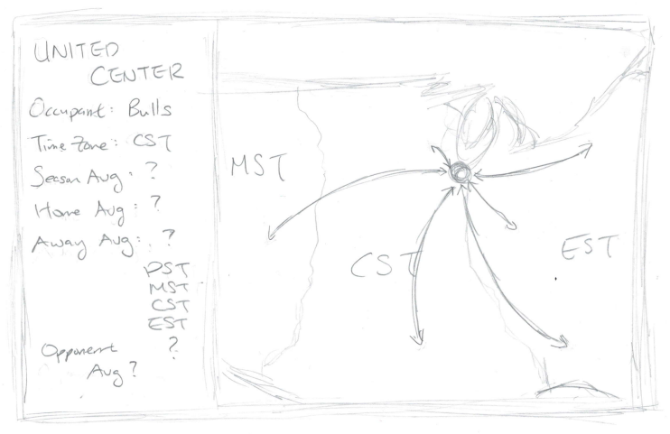

# Pandemic Basketball

## I. Introduction

In the history of professional sports, there has always been questions surrounding [home advantage](https://en.wikipedia.org/wiki/Home_advantage): 
Does it even exist? If so, what causes it? 
The three most commonly believed and cited factors are: 

1. <b>Crowd involvement: The psychological effects of cheering and booing from fans.</b> 
<i>Example: In Americans football, fans tend to stay silent when the home team is on offense, making it easier to run audibles and hear snap counts.
Conversely, crowds generate as much noise as possible when the opposing team has the ball to try to disrupt communication.</i>

2. <b>Travel considerations: The physical effects of travel fatigue and/or time-zone differential.</b> 
<i>Example: A traveling team is limited to hotel accomodations while the home team has all the luxuries of players' own homes.</i>

3. <b>Environmental factors: The familiarity of the environment (eg. weather, altitude).</b> 
<i>Example: In baseball, every stadium has different dimensions, giving the home team a slight advantage via the familiarity of their own park.</i>

Since all basketball stadiums are indoors with standard dimensions, environmental factors are naturally limited in the NBA. Outside of a few standalone factors, such as the high altitude in Denver, players can expect more or less the same environment every single game. Furthermore, due to the COVID-19 pandemic, the 2020-21 NBA Season saw the majority of teams either heavily limit or outright prohibit fan attendance. Thus, with two major factors essentially out of the equation, this project will use data and statistics from the season to see the effects of travel on home court advantage.

## II. Data

Data is mainly taken from [Basketball Reference](https://www.basketball-reference.com/leagues/NBA_2021.html) before being explored and analyzed in Jupyter Notebooks.

## III. Wireframe

Very first wireframe draft using United Center in Chicago as an example.